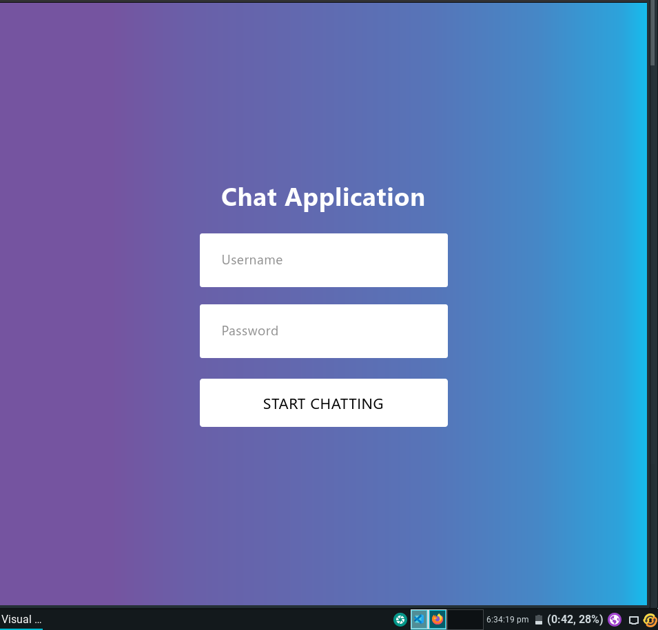

# Getting Started with Create React App

This project was bootstrapped with [Create React App](https://github.com/facebook/create-react-app).

## Available Scripts

In the project directory, you can run:

### `npm start`

Runs the app in the development mode.\
Open [http://localhost:3000](http://localhost:3000) to view it in the browser.

The page will reload if you make edits.\
You will also see any lint errors in the console.

### Deployment

https://teams-chat.netlify.app check.\
username = deepak (Login Page).\
password = 123

### Images
<table>
<tr>
<td></td></tr>
<tr>
<td></td></tr>
<tr>
<td></td></tr>
</table>

## Bugs / Issues
* If found, please report it in issues section.

## Contribute
* Any contributions or 

